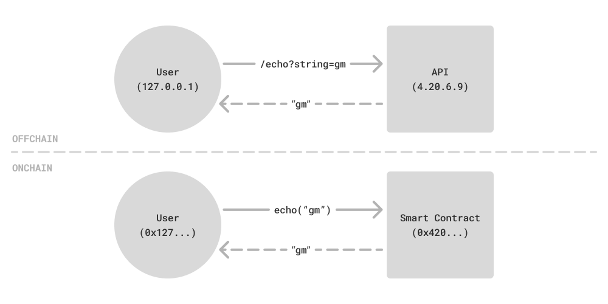

# 🔐 Part 1: Smart Contracts

*Learn to Read, Write, and Deploy an Onchain Prediction Market*

### ⏱️ Time Allocation (1 hr 30 min)

### 🎯 Learning Goals

By the end of this part, you'll be able to:

- ✅ **Understand Solidity fundamentals** and read smart contract code
- ✅ **Navigate blockchain data** using block explorers
- ✅ **Deploy and verify** your own smart contract to Base Sepolia
- ✅ **Understand the "Oracle Problem"** and how blockchains interact with real-world data
- ✅ **Collaborate with your pod** to explore and interact with each other's contracts

### 🏗️ Module Blueprint: What We Provide vs. What You Build

* **📦 Pre-Built (In the Starter Repo):** Foundry environment setup, `Deploy.s.sol` script, an `IPredictionMarket.sol` interface (your spec), a skeleton `PredictionMarket.sol` (your starting point), and a full test suite with 12 tests.
* **🛠️ What You Will Build:** The complete implementation of `PredictionMarket.sol` — all the function bodies, the `onlyOwner` modifier, and the `vote()` logic following the CEI pattern. The interface defines *what* the contract must do; you define *how*.
* **🤖 AI-Driven Development:** In this workshop, you are the **architect and reviewer**. AI is your **implementer**. You will: **(1)** read the interface to understand the spec, **(2)** prompt AI to implement it, **(3)** review the output against the interface and checklist, **(4)** run `forge test` to validate (all 12 tests must pass), and **(5)** deploy. This is the same workflow used in production.

> [!TIP]
> Don't just accept AI-generated code blindly. The review step is where the real learning happens — understanding *why* the code works (or doesn't) is more valuable than generating it.

### 🆘 Need Help?
Check out the **[Troubleshooting Guide](./troubleshooting)** for solutions to common issues including deployment and verification problems.

---

## 🧠 Understanding Smart Contracts (10 min)

### 🤖 What is a Smart Contract?

A smart contract is like a microservice: It defines an external interface, maintains state, and can make interactions with other services. Unlike typical microservices, contract code is immutable after deployment; state changes require a paid transaction (gas), while read-only calls are free.

> [!NOTE]
> Once deployed, a smart contract's code **cannot be changed**. If there's a bug, you must deploy an entirely new contract. This is why code review and testing are critical in Web3.

Smart contracts define functions which are like API routes. A service can expose many functions and each function has specific inputs and outputs.

Try this CLI command to call an `Echo` smart contract:

```copy
cast call 0x80617f1058D431A7a8394761DE26C711ce5963D0 "echo(string)(string)" "gm" --rpc-url "https://sepolia.base.org"
```


> [!IMPORTANT]
> **Core mental model:** This is analogous to doing `curl --get http://4.20.6.9/echo?message=gm` from a traditional offchain service.

Smart contracts share similar abstractions for a call target, function, and arguments:

| Item | API | Smart Contract |
| -- | -- | -- |
| Target | IP address → `4.20.6.9` | Blockchain address → `0x...` |
| Function | URL path → `/echo` | Function signature → `echo(string)` |
| Arguments | URL-encoded args → `message=gm` | ABI-encoded args → `"gm"` |

> [!IMPORTANT]
> Function signatures are ABI-encoded; names and types must match exactly. A typo in the function name or argument type will result in a failed call.

Here's the actual implementation of this `Echo` smart contract:

```solidity
contract Echo {
    function echo(string memory message) external pure returns (string memory) {
        return message;
    }
}
```

### How Smart Contracts Differ from Web2 Services

While the analogy to microservices is useful, smart contracts have two properties that fundamentally change how you think about code:

**1. 🔄 Synchronous, Deterministic Execution**

In Web2, your server makes async calls to databases, APIs, and queues. You deal with race conditions, eventual consistency, and timeout handling. Smart contract execution is **purely synchronous** — every operation runs in sequence, and the result is identical no matter which machine in the network executes it. This determinism is what allows thousands of nodes worldwide to independently verify the same transaction and agree on the outcome.

From a design perspective, this actually simplifies the developer experience. You don't worry about race conditions the same way you would in traditional software engineering.

**2. 🗄️ Unified State (No Separate Database)**

A typical Web2 service stores state in an external database — Postgres, Redis, DynamoDB. The server and the database are separate systems with separate failure modes.

A smart contract **_is_** the database. Code and state live together at the same address. When you define `mapping(address => uint256) public balanceOf`, that mapping is permanently stored on the blockchain — no ORM, no migrations, no connection strings. Reading state is free; writing state costs gas (more on that later).

**3. 📬 Everything Is an Address**

On the blockchain, every entity has an **address** — a 20-byte hex string (e.g., `0x123...abc`). Your wallet is an address backed by a private key. A smart contract is an address backed by bytecode. Both can send and receive messages. Smart contracts can also call other smart contracts, making them composable microservices that build on each other.

Now that you know how smart contracts work at a high level, let's look at what we're building.

<QuizSmartContractBasics id="sc-smart-contract-basics" />

---

## 🧠 Understanding the Prediction Market (10 min)

### 🎲 What is a Pari-Mutuel Prediction Market?

A **Pari-Mutuel** (French for "mutual betting") prediction market works like this:

- **Users vote** on a binary outcome: Yes or No (e.g., "Will it rain tomorrow?")
- **Winners split the losers' tokens** proportionally when the market resolves
- **Odds** are derived from the current pool sizes: `yesPool` / `noPool` reflect where the money is

**📊 Example:**

```
yesPool: 100 tokens | noPool: 50 tokens
→ If you bet YES and win: you get ~1.5x your stake (plus your stake back)
→ If you bet NO and win: you get ~3x your stake (plus your stake back)
```

### 🔤 Solidity Quick Reference

Here are the Solidity building blocks you'll see in the contract. Don't memorize these — refer back as needed.

**🔢 Core Data Types:**

-   `bool` – `true` or `false`
-   `uint` – unsigned integers (only positive) with size-bound variants (e.g. `uint8`)
-   `int` – signed integers (negative and positive) with size-bound variants (e.g. `int256`)
-   `address` – account address (e.g. `0x123...abc`)
-   `bytes` – Hexadecimal data (e.g. `0x456...def`) with fixed/variable size variants (e.g. `bytes32`)
-   `string` – Text data (e.g. `"Hello World"`) only in variable size
-   `struct` – Custom data containers that group related fields together

**📦 Storage Structures:**

-   `mapping` – Key-value storage (e.g. `marketId → voter → hasVoted`)
-   `arrays` – Lists of items (e.g. `Market[]` for all markets)

**⚙️ Visibility Modifiers:**

-   `external`: callable only from other addresses
-   `internal`: callable within this contract and contracts that inherit it
-   `public`: callable both internally and externally
-   `private`: callable only from within this contract (not accessible to inheriting contracts)

**⚙️ Mutability Modifiers:**

-   `(default)`: able to read from and write to storage
-   `view`: only allowed to read from storage
-   `pure`: not allowed to read from or write to storage

**🔍 Logs:**

-   Recorded in transaction receipts (indexed), not in the contract's storage
-   Not readable by contracts during execution, but can be viewed offchain
-   Define with `event Name(...typed args)`, emit with `emit Name(args)`

<FreeResponse id="sc-prediction-market-mental-model" label="In your own words, explain how a pari-mutuel market works. What determines the payout?" />

# 🔍 Code Walkthrough: The Interface (20 min)

_Read the spec and implement your PredictionMarket contract._

### 📥 Get the Code

Clone the [**neo-workshop-smart-contracts**](https://github.com/XanderPSON/neo-workshop-smart-contracts) repo (used for Parts 1 & 2):

```copy
git clone -b prediction-market https://github.com/XanderPSON/neo-workshop-smart-contracts.git
cd neo-workshop-smart-contracts
forge build
```

The repo contains:
- `src/IPredictionMarket.sol` — The interface (your spec)
- `src/PredictionMarket.sol` — The skeleton (your starting point, all functions revert "Not implemented")
- `test/PredictionMarket.t.sol` — 12 tests that validate your implementation
- `solutions/PredictionMarket.sol` — Reference implementation (don't peek unless stuck!)

> [!TIP]
> Run `forge test` before you start — you'll see all 12 tests fail. After implementing, they should all pass.

### 🧩 What Is an Interface, and Why It Matters?

In Solidity, an interface is a **contract API definition**. It declares what functions, events, and errors exist, but does not include the implementation logic. The `I` prefix in `IPredictionMarket.sol` is a Solidity convention meaning "interface" — it specifies *what* functions must exist, but not *how* they work.

Why this is useful in Web3:

- **For developers:** It gives a clear spec of what the contract must do.
- **For other smart contracts:** They can call your deployed contract through the interface type.
- **For frontends and tooling:** The interface/ABI is used to encode function calls and decode returned data.

In this workshop, your task is:

1. Read `src/IPredictionMarket.sol` carefully. This file is your spec for required behavior.
2. Implement that spec in `src/PredictionMarket.sol` (where function bodies currently revert with `"Not implemented"`).
3. Use AI as your implementation partner, then review and test the result.

### 📋 Your Spec: `IPredictionMarket.sol`

Open `src/IPredictionMarket.sol` in your repo. This **interface** is your contract spec — it defines *what* your contract must do, but not *how*. Think of it like an API definition:

- **Events** your contract must emit (`MarketCreated`, `Voted`, `MarketResolved`)
- **Custom errors** your contract must use (`NotOwner`, `MarketAlreadyResolved`, `AlreadyVoted`, `ZeroAmount`)
- **Functions** your contract must implement (8 total: `owner`, `totalMarkets`, `getOdds`, `getMarket`, `hasVoted`, `createMarket`, `vote`, `resolveMarket`)
- **Struct fields** your `Market` must contain (`question`, `yesPool`, `noPool`, `resolved`, `outcome`)

Your skeleton at `src/PredictionMarket.sol` already inherits this interface and has the struct + storage defined. Every function body says `revert("Not implemented")` — that's what you'll replace.

### 📋 Key Requirements

As you read the interface, pay attention to:

1. **CEI pattern** in `vote()` – the NatDoc comments spell out Checks, Effects, Interactions
2. **`onlyOwner`** on `createMarket()` and `resolveMarket()` – we'll discuss why that's a security trade-off
3. **Custom errors** instead of `require` strings – more gas-efficient and informative

> [!IMPORTANT]
> The **CEI pattern** (Checks-Effects-Interactions) is non-negotiable in production smart contracts. Skipping it has led to some of the largest hacks in crypto history, including the $60M DAO hack in 2016.

### 🛡️ CEI Pattern in `vote()`

The **CEI Pattern (Checks, Effects, Interactions)** prevents reentrancy and keeps state consistent. When writing state-changing functions (like placing a bet), Web3 engineers strictly follow this pattern to prevent hacks:

1. **Checks** – Validate all inputs and conditions first (e.g., `msg.value > 0`, market not resolved)
2. **Effects** – Update internal contract state (e.g., `hasVoted[marketId][msg.sender] = true`, update pools)
3. **Interactions** – Send funds or interact with external contracts *last*

> [!WARNING]
> If you reverse the order and call an external contract **before** updating storage, a malicious contract could re-enter your function and exploit it (e.g., drain all funds). Always update state before making external calls.

### 🤖 Implement Your Contract with AI

Open `src/PredictionMarket.sol`. The struct, storage, and constructor are already wired up. Your job is to implement every function body. Feed the interface to your AI and prompt it:

<AIPrompt prompt="Here is my Solidity interface IPredictionMarket.sol and my skeleton PredictionMarket.sol. Implement all the function bodies. The vote() function must follow the Checks-Effects-Interactions pattern. Use the custom errors defined in the interface (not require strings). The createMarket and resolveMarket functions should be restricted to the owner using an onlyOwner modifier." />

### ✅ Review Checklist

After AI generates your implementation, verify:

<ChecklistReviewContract id="sc-review-contract" />

### 📄 Reference Solution

If you're stuck or want to compare, a reference implementation is available at `solutions/PredictionMarket.sol` in the repo.

> [!TIP]
> Try to get all 12 tests passing before looking at the reference. The tests are your best guide — each one validates a specific behavior from the interface.

> [!TIP]
> **Part 2 Preview:** You'll upgrade this contract to accept an ERC-20 token instead of ETH. The `vote` function will then require `approve` + `transferFrom` (the Allowance Pattern).

### 💬 Top Questions to Ask Your AI

After comparing your contract to the reference, try these follow-up prompts:

<AIPrompt prompt="If I removed the onlyOwner modifier from resolveMarket(), describe a concrete attack sequence someone could use to steal all funds from the contract." />

<AIPrompt prompt="My contract stores votes in a mapping. What happens if I want to let users change their vote before the market resolves? Walk me through the storage changes and edge cases." />

<AIPrompt prompt="Imagine this contract holds $10M in real ETH. What's the single most dangerous line of code, and how would you exploit it?" />

# 🔎 Block Explorer & Gas

_Navigate blockchain data and understand transaction costs._

## 🔎 Block Explorer Exploration (15 min)

### 🧭 What is a Block Explorer?

A **block explorer** is your window into blockchain data – think of it as the blockchain's equivalent of a database viewer. It lets you read contract state, view transaction history, and interact with smart contracts through a web interface.

In day-to-day smart contract work, this is one of the tools you'll use most often:

**🧰 Why explorers are essential:**

-   ✅ You can **verify** that your contract deployed correctly.
-   🐞 You can **debug transactions** and see why they failed.
-   📖 You can **read contract state** to check current values without writing code.
-   🔘 You can **interact with contracts** by calling functions directly from the browser.

**🌐 Popular Block Explorers:**

-   [**BaseScan**](https://basescan.org/) (Base network) – What we'll use today
-   [**Etherscan**](https://etherscan.io/) (Ethereum mainnet)
-   [**Solscan**](https://solscan.io/) (Solana network)

### 🕵️‍♂️ Hands-on Exploration / Scavenger Hunt

**🧪 Live Target Contract:** `0x32593a9DFe40e4605A02A32BCFC7FEfF30BBDd94`

**🎯 Goal:** Before placing a bet, you must **read the current odds** on the instructor's contract using BaseScan.

This mirrors real Web3 workflow: verify what contract you are talking to, read onchain state, submit a write transaction, then inspect and reason about what happened.

<details>
<summary><strong>1. 🔍 Contract Overview</strong></summary>

> [!IMPORTANT]
> In Web3, the contract address is the source of truth. You always verify identity and provenance before trusting or integrating with a contract.

- **🧭 LOCATE:** Go to [sepolia.basescan.org](https://sepolia.basescan.org) and paste the address
- **🔎 FIND:** Deployment date and gas cost (click "Transactions" → click the first/oldest transaction)
- **✅ CHECK:** Green checkmark = verified source code

<FlavorText id="sc-hunt-1-overview" emoji="🔍" text="You should see 'PredictionMarket' as the contract name" />

</details>

<details>
<summary><strong>2. 📖 Read Contract</strong></summary>

> [!IMPORTANT]
> Reading state is free and safe. Good Web3 developers read first, form a hypothesis, and only then send transactions that cost gas.

**🎲 Read the Odds**

- **🖱️ CLICK:** "Read Contract" tab
- **⚙️ CALL:** Query the `markets` function with market ID `0`
- **🧠 CONSIDER:** What is the `yesPool`? What is the `noPool`? Which side gives you a better payout multiplier?
- **🧠 CONSIDER:** If `yesPool = 100` and `noPool = 50`, what's the implied probability of YES?

<FlavorText id="sc-hunt-2a-odds" emoji="🎲" text="You've read the current pool sizes and can calculate implied odds" />

**🐋 Whale Watching (Spying on the network)**

> [!IMPORTANT]
> Transaction input data reveals user intent. Decoding calldata is a core onchain debugging and research skill.

- **🖱️ CLICK:** "Transactions" tab
- **🔎 FIND:** The largest recent transaction and click the transaction hash
- **🖱️ CLICK:** Expand Click to show more, then click Decode Input Data — did this user vote Yes or No?

<FlavorText id="sc-hunt-2b-whale" emoji="🐋" text="You've decoded a vote transaction and identified which side the user chose" />

</details>

<details>
<summary><strong>3. 🖋️ Write Contract</strong></summary>

> [!IMPORTANT]
> This is the irreversible part of Web3 flow. Wallet signatures, ETH value, and calldata all become part of the permanent public record.

- **🧭 LOCATE:** Select the "Contract" tab, then within it, click "Write Contract" to access the write functions.
- **🖱️ CLICK:** `🔴 Connect to Web3` (Connect your Coinbase Wallet)
- **✍️ ACT:** Expand the `vote()` function. Enter market ID `0`; `side`: `true` = YES, `false` = NO
- **✍️ ACT:** Send ETH in the "Value" field (e.g., `1000000000000000` wei = 0.001 ETH)
- **🖱️ CLICK:** Approve transaction confirmation in your wallet
- **🖱️ CLICK:** "View transaction" button on BaseScan

<FlavorText id="sc-hunt-3-write" emoji="🖋️" text="Your vote transaction appears in the contract's transaction history" />

</details>

<details>
<summary><strong>4. 📊 Transaction Analysis</strong></summary>

> [!IMPORTANT]
> Every onchain write should be followed by verification. You inspect function calls and gas usage to debug failures and improve cost efficiency.

- **🖱️ CLICK:** "Transactions" tab on the contract page to see all interactions
- **🖱️ CLICK:** Any recent transaction hash to open its detail page

**Finding the function called:**
- **🔎 SCROLL** down to the **"Input Data"** section at the bottom of the Overview tab
- When the contract is verified, BaseScan auto-decodes the raw hex into a human-readable function signature — look for a line like `Function: createMarket(string question)` and a `MethodID` (e.g., `0x54888f55`)
- The decoded parameters appear right below (e.g., the string argument you passed in)

> [!TIP]
> If Input Data only shows raw hex, click **"Decode Input Data"**. If that doesn't work, the contract may not be verified on BaseScan.

**Finding gas used:**
- **🔎 FIND** the **"Gas Limit & Usage by Txn"** field in the middle of the Overview tab — it shows something like `107,194 / 108,202 (99.07%)`

**Bonus — checking emitted events:**
- **🖱️ CLICK** the **"Logs"** tab (next to Overview) to see events the contract emitted (e.g., `MarketCreated` with the market ID and question string). This confirms exactly what the contract did.

<FlavorText id="sc-hunt-4-analysis" emoji="📊" text="You understand what each transaction did" />

</details>

<details>
<summary><strong>5. 🧭 Advanced Navigation</strong></summary>

> [!IMPORTANT]
> Web3 is graph-shaped, not page-shaped. Following addresses, contracts, and events helps with security research, user analytics, and protocol understanding.

- **🖱️ CLICK:** The owner's address → see what other contracts they've deployed
- **🖱️ CLICK:** Any voter's address from a transaction → see their full activity history
- **✅ CHECK:** "Events" tab in any transaction for emitted events

<FlavorText id="sc-hunt-5-navigation" emoji="🧭" text="You can follow the web of relationships between users, contracts, and transactions" />

</details>

<FlavorText id="sc-explorer-done" emoji="🕵️" text="Block explorer mastery: unlocked" />

---

## ⛽ Understanding Gas (10 min)

During the scavenger hunt, you saw "Gas Used" on every transaction. But what is gas, and why does it exist?

### 🧱 Why Gas Exists

Blockchains are public networks — anyone in the world can submit transactions. Without a cost mechanism, an attacker could flood the network with infinite transactions (a DoS attack) for free. Gas is the solution: **every computation costs money**, so spam becomes economically impractical.

This is one of the most interesting properties of onchain development: **financial incentives as a security mechanism**. Instead of rate limiters and API keys, the network charges users directly for the computational resources they consume.

### 🧮 How Gas Is Calculated

Every Solidity operation compiles down to **bytecode**, which the EVM (Ethereum Virtual Machine) executes as a series of low-level operations called [**opcodes**](https://www.evm.codes/). Each opcode has a fixed gas cost — for example, simple addition (`ADD`) costs 3 gas, while storing a value to persistent storage (`SSTORE`) costs 20,000+ gas.

The total transaction fee is:

```
Transaction Fee = Gas Used × Gas Price (per unit)
```

For example, if your transaction uses 73,000 gas units at a gas price of 0.012 gwei per unit, your fee is ~0.000000876 ETH.

<GasFeeCalculator gasUsedDefault={73000} gasPriceGweiDefault={0.012} />

### ⚖️ Gas Limit vs. Gas Used

When you submit a transaction, you set a **gas limit** — the maximum gas you're willing to pay. This protects you against a malicious contract that might try to consume infinite computation. You only pay for the gas actually used, but if execution exceeds your limit, the transaction reverts (and you still pay for the gas consumed up to that point).

### 💸 Where Do Fees Go?

On Ethereum mainnet, fees go to the validators running nodes. On **Base**, fees go to the **sequencer** — the single node that orders and executes transactions. Base also pays fees to post its transaction data to Ethereum L1 as a security measure (the "L1 data fee" you'll see on some transactions).

### 📈 The Fee Market (EIP-1559)

Gas prices aren't fixed — they adjust dynamically based on demand. **EIPs** (Ethereum Improvement Proposals) are the standards process for changes to Ethereum — anyone can propose one by opening a PR on the public [ethereum/EIPs](https://github.com/ethereum/EIPs) repo. [EIP-1559](https://eips.ethereum.org/EIPS/eip-1559) is one of the most impactful: it defines the fee market algorithm. When the network is congested, the **base fee** increases to discourage demand; when demand is low, the base fee decreases. You can also add a **priority fee** (tip) to incentivize faster inclusion.

> [!TIP]
> **Exercise:** Go back to a transaction you found in the scavenger hunt. Find "Gas Used", "Gas Price", and calculate the total fee. Compare it to the "Transaction Fee" shown — does the math check out?

<QuizGas id="sc-gas-purpose" />

# 🚀 Deploy Your Prediction Market (20 min)

_Deploy, verify, and debug your contract on Base Sepolia._

**🎯 Goal:** Contract deployed, verified, and at least one market created. Pod members have read odds and placed bets.

### ⚙️ Configure and Deploy

1. **Load Environment Variables**

    If you haven't already in this terminal, source the `.env` file you created during setup:

    ```copy
    source .env
    ```

    This loads `WALLET_ADDRESS`, `ETHERSCAN_API_KEY`, and all your other keys. Run `echo $WALLET_ADDRESS` to confirm it's set.

2. **Deploy Script**

    Your `Deploy.s.sol` should deploy `PredictionMarket` with:
    - `owner_` = your address (or `msg.sender`)

    ```copy
    forge script Deploy \
        --account dev \
        --sender $WALLET_ADDRESS \
        --rpc-url https://sepolia.base.org \
        --broadcast \
        --verify \
        --verifier etherscan \
        --etherscan-api-key $ETHERSCAN_API_KEY
    ```

    > [!TIP]
    > The `--sender` flag tells Foundry to use your wallet as `msg.sender` in the deploy script — without it, the contract's owner will be set to Foundry's default address instead of yours.

    > [!WARNING]
    > **Deployment issues?** Check our **[Deployment Troubleshooting](./troubleshooting#deployment-issues)** for solutions to common errors like nonce mismatches, insufficient gas, and verification failures.

3. **Save your contract address**

    Copy the `deployed to:` address from the output and save it to your `.env`:

    ```copy
    # ✏️ Replace 0xYOUR_CONTRACT_ADDRESS with the address from the deploy output
    sed -i '' 's/^PREDICTION_MARKET_ADDRESS=.*/PREDICTION_MARKET_ADDRESS=0xYOUR_CONTRACT_ADDRESS/' .env
    source .env && echo "✅ Saved: $PREDICTION_MARKET_ADDRESS"
    ```

4. **Create a Market**

    - Go to your contract on BaseScan → "Write Contract" → Connect wallet
    - Call `createMarket("Will it rain tomorrow?")` (or your own question)
    - You must be the owner

### 🧪 Quick Test

Visit your contract on BaseScan and interact with it:

- [ ] Go to your contract address on [sepolia.basescan.org](https://sepolia.basescan.org)
- [ ] Click "Read Contract" to view contract data
- [ ] Try the "Write Contract" section to create markets (if you're the owner)
- [ ] Have pod members place votes through the interface

### 🐛 Debugging Exercise: When Your Wallet Lies

If you try to create a market and your wallet shows **"Unable to estimate network fee"** — congratulations, you've hit a classic Web3 debugging trap.

<details>
<summary><strong>🔍 What's actually happening?</strong></summary>

Your wallet tries to simulate the transaction before showing you a fee estimate. If the simulation hits a `revert` in the smart contract, the wallet interprets this as "infinite gas required" and surfaces it as a network fee error. The real problem has nothing to do with gas.

</details>

<details>
<summary><strong>🩺 How to diagnose</strong></summary>

1. **Go to BaseScan** — Look at your contract's "Read Contract" tab. Call the `owner()` function. Does it return *your* wallet address?
2. **If the owner is wrong** — Your deploy script set a different address as the owner. You deployed a contract where you're not the owner, so `createMarket()` reverts with `NotOwner`.
3. **The fix** — Update `Deploy.s.sol` to use `msg.sender` as the owner (it should already, but verify!), then redeploy.

</details>

<details>
<summary><strong>🧠 The broader lesson: Your tools will mislead you</strong></summary>

Wallets, block explorers, and SDKs all add layers of abstraction that can obscure what's actually happening onchain. When something fails:

1. **Don't trust the error message** — it's often wrong or misleading
2. **Go to the block explorer** — it shows the actual onchain state, which doesn't lie
3. **Read the contract code** — find the `revert` that's triggering and trace backward
4. **Verify what you signed** — if you're deploying contracts or signing transactions, always confirm the parameters match your intent

> [!CAUTION]
> This applies to real money too. If you're signing transactions without verifying the details, you could lose funds. Always lean on the chain as your source of truth — not the wallet UI, not the dApp frontend, not even your teammates. **Verify onchain.**

</details>

**✅ Success:** Contract deployed, verified, and working!

<Scale id="sc-deploy-confidence" max={5} label="How confident do you feel about deploying smart contracts?" />

---

## 🔮 The Oracle Problem (5 min)

Your market can accept bets, but how does it know who won?

**Who is allowed to call `resolveMarket()`?** If *anyone* could call it, a user would bet "Yes", call `resolveMarket(Yes)`, and steal everyone's money. That's why the contract uses access control — only the `owner` (the deployer) can resolve:

```solidity
// Only the person who deployed the contract can trigger this!
if (msg.sender != owner) revert NotOwner(msg.sender, owner);
```

### 🛑 The Gotcha: What is an Oracle?

In web3, an **oracle** is any mechanism that feeds external, real-world data into a blockchain. Smart contracts are completely isolated — they can't call APIs, check the weather, or read the news on their own. An oracle bridges that gap.

In your contract, **you** are the oracle. You made yourself the `owner`, which means you are the sole judge of truth for every market. You decide who won.

This is a well-known, fundamental challenge in blockchain called the **Oracle Problem**: how do you get trustworthy real-world data onchain without trusting a single person? Your contract has this problem right now — and every production prediction market has had to solve it.

> [!CAUTION]
> If you were building Polymarket for real, having a human "owner" is a **massive security flaw** — they could lie, resolve every market in their favor, and steal everyone's funds.

In production, you would replace `msg.sender == owner` with a **decentralized oracle network** like [Chainlink](https://chain.link/) or [UMA](https://uma.xyz/) — systems where independent validators fetch real-world data from multiple sources, reach consensus on the answer, and push the verified result onchain. No single person controls the truth.

<FreeResponse id="sc-oracle-reflection" label="Why is a centralized oracle (like an 'owner') dangerous for a real prediction market? What could go wrong?" />

# 🤝 Pod Cross-Play & Wrap-Up (10 min)

_Test your contracts together and reflect on what you built._

Let's test our Web3 infrastructure and watch the Pari-Mutuel math in action!

1. **🔗 Share:** Drop your deployed BaseScan contract URL into your Pod's chat.
2. **🗣️ Create a Market:** Use the "Write Contract" tab to create a fun market (e.g., *"Will Pod 3 finish the Token module first?"*).
3. **💸 Vote & Strategize:** Navigate to your pod-mates' contracts and place bets on their markets. *Pay attention to the odds! Try betting heavily on one side to skew the pool, then have another pod-mate bet on the opposite side to capture the upside.*
4. **⚖️ Resolve:** As the `owner` of your contract, call the `resolveMarket` function to lock the bets!

### ✅ What You Accomplished

- ✅ Learned Solidity fundamentals and built a PredictionMarket contract with AI
- ✅ Understood the pari-mutuel market (struct, mappings, CEI pattern, `onlyOwner`)
- ✅ Understood the Oracle Problem (centralized `resolveMarket`)
- ✅ Used BaseScan to read odds, place votes, and analyze transactions
- ✅ Deployed and verified your contract to Base Sepolia
- ✅ Created markets and collaborated with your pod (share addresses, read odds, place bets)

### 💡 Real-World Applications
The smart contract patterns you just built are the same foundations used in production:
* **Polymarket:** The world's largest prediction market uses the same pari-mutuel structure and market resolution mechanics you implemented.
* **Augur / Gnosis:** Decentralized prediction platforms that replace the centralized `owner` with oracle networks like [Chainlink](https://chain.link/) and [UMA](https://uma.xyz/) — solving the Oracle Problem you explored.
* **OpenZeppelin Access Control:** The `onlyOwner` modifier pattern you used is the basis for role-based access control across all major DeFi protocols.
* **Uniswap / Aave:** The CEI (Checks-Effects-Interactions) pattern you practiced is a mandatory security practice in every production smart contract that handles value.

### 🔓 "But the Code is Public — Can't You Just Copy It?"

Since all smart contract code is onchain and often verified/open-source, a natural question is: what stops someone from copying Uniswap's code and launching a competitor? Three things:

1. **Legal protections:** Uniswap v3 was one of the first major protocols to use a [Business Source License (BSL)](https://github.com/Uniswap/v3-core/blob/main/LICENSE) — essentially saying "copy this code and we'll sue you."
2. **Economic moats:** Even if you fork the code, the original has more **liquidity** (capital deposited by users). More liquidity means better prices, which attracts more users, which attracts more liquidity. This flywheel is hard to replicate.
3. **Off-chain infrastructure:** Protocols build ecosystems of tooling, indexers, SDKs, and integrations around their contracts. You can fork the onchain code, but not the off-chain ecosystem that makes it useful.

---

## ✨ Enhance Your Contract

**⏱️ Finished early?** Try one of these stretch goals:

1. **`withdrawWinnings()`** – Implement payout logic so winners can claim their share when the market resolves. You'll need to track each voter's stake and side, then calculate their proportional share of the losing pool. Great practice for CEI and `transfer()`.

2. **`getPotentialWinnings(marketId, voter)`** – Add a `view` function that calculates what a voter would receive if they won. Reinforces the pari-mutuel math and read-only functions.

3. **Minimum bet or voting deadline** – Add validation (e.g., `require(amount >= minBet)`) or a `votingEndsAt` timestamp so votes are rejected after a cutoff. Teaches modifiers and time-based logic.

---

**🎉 Part 1: Smart Contracts Complete!**

You've deployed your first prediction market! Now let's create your own token and upgrade the market to use it.

<TemperatureCheck id="sc-understanding-check" />

<FlavorText id="sc-part1-complete" emoji="🔐" text="Smart contract developer: activated" />

**Next: [🪙 Token Standards](./02-token-standards)**
